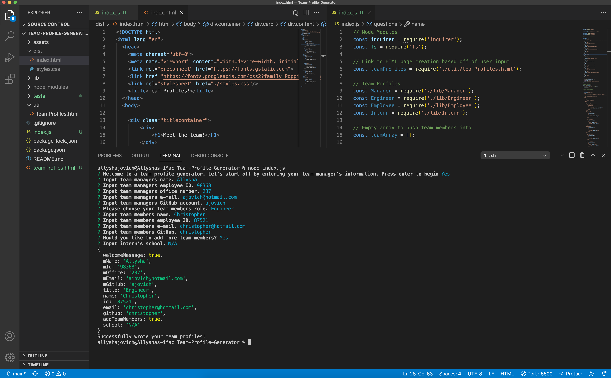

# Team-Profile-Generator

## Description

*  This is a Node.js command-line application that will take information about employees from a user and generate an HTML webpage that displays a summary for each team member. 

* This application also includes unit tests.

* User input includes the following:

    * Position of team member: manager, engineer, employee, or intern

    * Name

    * Office Number (team manager only)

    * Employee Number

    * E-mail

    * GitHub Account

    * School (intern only)

## Goals

* By allowing the user to have access to a team profile generator, the user:

    * will be able to have easy access to current team members e-mails, and GitHub accounts

## Usage

* This application utilizes the Inquirer npm package for collecting input from the user.

    * Click [here](https://www.npmjs.com/package/inquirer) to go to the npmjs.com/package/inquirer

* This application also uses the Jest npm package for running unit tests. 

    * Click [here](https://www.npmjs.com/package/jest) to go to the npmjs.com/package/jest

* In order to run this application, please ensure node.js is downloaded.

    * Click [here](https://nodejs.org/en/) to go to nodejs.org 

## Animation & Images

* <iframe src="https://drive.google.com/file/d/1jNQrWvhbOdft3DlQJJVZNo1VNL8gaqjb/preview" width="640" height="480"></iframe>

* TBD 

* TBD 

* TBD 

## Link to GitHub Repository

* TBD